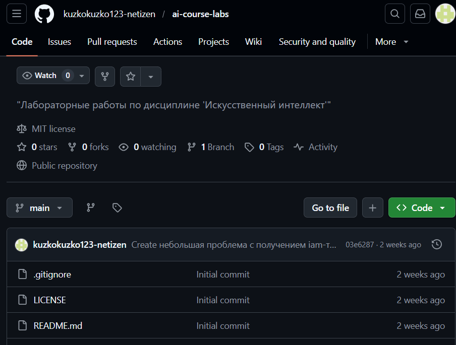
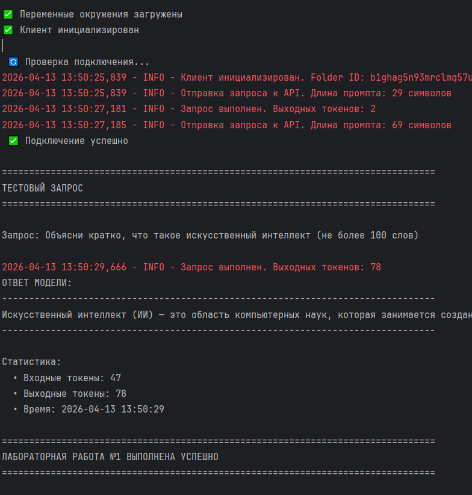
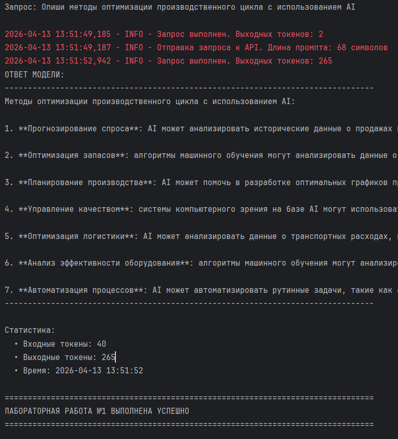

# Отчёт по лабораторной работе №1

## Дисциплина: Искусственный интеллект--

## Общая информация

| Параметр            | Значение                    |
|---------------------|-----------------------------|
| **Студент**         | [Мыльников Александр Русланович] |
| **Группа**          | [ФИТ-221]                   |
| **Дата выполнения** | [13.04.2026]                |
| **Специальность**   | [02.03.02 Фундаментальная информатика и информационные технологии]               |
| **Тема диплома**    | [Разработка системы неразрушающего контроля для выявления дефектов (брака) металлических бутылок на конвейерной линии]          |--

## 1. Цель работы

[
 Настроить изолированную среду разработки для AI-проектов
 Создать и настроить GitHub-репозиторий для сдачи всех лабораторных работ
 Получить доступ к российским AI-платформам
 Выполнить первый программный вызов LLM API]--

## 2. Выполненные задачи- [ ] Настроено окружение Python 3.10+- [ ] Создан GitHub-репозиторий- [ ] Получены API-ключи Yandex Cloud- [ ] Реализован базовый вызов API- [ ] Выполнен адаптированный запрос--

## 3. Ход работы

### 3.1. Настройка окружения

[]

/```bash

# Команды установки

python --version
pip install -r requirements.txt
/```

### 3.2. Создание репозитория

[]- URL репозитория: `https://github.com/kuzkokuzko123-netizen/ai-course-labs`- Текущая ветка: `week1`

### 3.3. Получение API-ключей

[]- Cloud ID: `b1g...`- Folder ID: `b1g...`

### 3.4. Тестовый запрос

**Запрос:**
/```
Объясни кратко, что такое искусственный интеллект
/```
**Ответ:**
/```
[Искусственный интеллект (ИИ) — это область компьютерных наук, которая занимается созданием машин и программ, способных выполнять задачи, требующие интеллектуальных усилий, аналогичных человеческим. ИИ использует алгоритмы и методы для обработки данных, обучения на основе опыта и решения сложных задач. Он применяется в различных сферах, таких как медицина, финансы, транспорт и развлечения, для автоматизации процессов, анализа больших объёмов информации и принятия решений.]
/```
[]

### 3.5. Адаптированный запрос

**Специальность:** [Техническая]
**Запрос:**
/```
[Опиши методы оптимизации производственного цикла с использованием AI]
/```
**Ответ:**
/```
[Методы оптимизации производственного цикла с использованием AI:

1. **Прогнозирование спроса**: AI может анализировать исторические данные о продажах и выявлять тенденции, что позволяет более точно прогнозировать будущий спрос на продукцию и оптимизировать производственные мощности.

2. **Оптимизация запасов**: алгоритмы машинного обучения могут анализировать данные о запасах, спросе и поставках, чтобы определить оптимальные уровни запасов и минимизировать издержки на их хранение.

3. **Планирование производства**: AI может помочь в разработке оптимальных графиков производства, учитывая такие факторы, как доступность ресурсов, сроки выполнения заказов и производственные мощности.

4. **Управление качеством**: системы компьютерного зрения на базе AI могут использоваться для автоматического контроля качества продукции на производственной линии, что позволяет выявлять дефекты и предотвращать выпуск некачественной продукции.

5. **Оптимизация логистики**: AI может анализировать данные о транспортных расходах, времени доставки и других параметрах, чтобы оптимизировать логистические операции и снизить издержки на доставку продукции.

6. **Анализ эффективности оборудования**: алгоритмы машинного обучения могут анализировать данные о работе оборудования, выявлять закономерности и предсказывать возможные поломки, что позволяет планировать техническое обслуживание и минимизировать простои.

7. **Автоматизация процессов**: AI может автоматизировать рутинные задачи, такие как сбор и анализ данных, что освобождает время сотрудников для более сложных и творческих задач.]
/```
[]--

## 4. Результаты

| Критерий            | Статус |
|---------------------|--------|
| Окружение настроено |

✅
|
| Репозиторий создан |
✅
|
| Ветка week1 создана |
✅
|
| API работает |
✅
|
| Адаптация выполнена |
✅
|--

## 5. Выводы

[Изучил изолированную среду разработки для AI-проектов, трудности только с получением токенов были, использовать буду как получится ]--

## 6. Список источников

1. Yandex Cloud Documentation. URL: https://cloud.yandex.ru/docs/
2. LangChain Documentation. URL: https://python.langchain.com/
3. GitHub Documentation. URL: https://docs.github.com/
