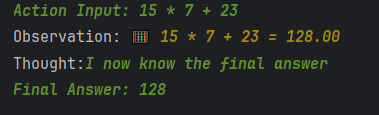
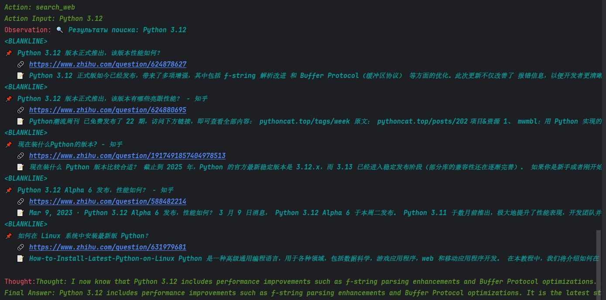

## Дисциплина: Искусственный интеллект--
## Общая информация
| Параметр | Значение                                                                                                               |
|----------|------------------------------------------------------------------------------------------------------------------------|
| **Студент** | [Мыльников Александр Русланович]                                                                                                        |
| **Группа** | [ФИТ-221]                                                                                                              |
| **Специальность** | [02.03.02 Фундаментальная информатика и информационные технологии]                                                     |
| **Тема диплома** | [Разработка системы неразрушающего контроля для выявления дефектов (брака) металлических бутылок на конвейерной линии] |--
## 1. Цель работы
[Целью лабораторной работы является практическое освоение технологии создания интеллектуальных агентов с использованием фреймворка LangChain. В ходе работы необходимо реализовать AI-агента, способного:
- Использовать различные инструменты для решения задач
- Сохранять контекст диалога в краткосрочной памяти
- Хранить знания в долгосрочной семантической памяти (ChromaDB)
- Защищаться от вредоносных запросов с помощью guardrails
- Интегрироваться с YandexGPT для обработки естественного языка]--
## 2. Выполненные задачи- [ ] Реализовано ядро агента на LangChain
- 
- [x] Реализовано ядро агента на LangChain
- [x] Создано 3 инструмента (поиск, калькулятор, контроль качества)
- [x] Реализован кастомный инструмент для специальности (неразрушающий контроль бутылок)
- [x] Подключена семантическая память (ChromaDB)
- [x] Реализованы guardrails (валидация входных данных)
- [x] Написаны и пройдены юнит-тесты (17/17)--
## 3. Ход работы
### 3.1. Архитектура агента
[Агент построен на основе паттерна **ReAct** (Reasoning + Acting) с использованием фреймворка **LangChain** и языковой модели **YandexGPT**.]
### 3.2. Реализованные инструменты
| Инструмент | Назначение | Параметры |
|-----------|-----------|-----------|
| search_web | Поиск в интернете | query, num_results |
| calculate | Вычисления | expression, precision |
| custom_tool | Неразрушающий контроль металлических бутылок | bottle_id, inspection_method, threshold_defect |
### 3.3. Кастомный инструмент
[Автоматизация неразрушающего контроля металлических бутылок на конвейерной линии. Инструмент симулирует работу ультразвукового дефектоскопа и выявляет дефекты (геометрические отклонения, трещины, включения)]
[Параметры:
- `bottle_id` — идентификатор бутылки
- `inspection_method` — метод контроля (ультразвук, вихретоковый, оптический, термография)
- `threshold_defect` — порог чувствительности (0.0–1.0)]
[tool = CustomTool()
result = tool._run("BOTTLE-001", "ультразвук")]
### 3.4. Тестирование
[Запрос: "Рассчитай 15 * 7 + 23"
Ответ: 128]
[]
[Запрос: "Найди информацию о Python 3.12"
Ответ: "Python 3.12 has been officially released and includes 
        enhancements such as improved f-string parsing and 
        optimizations in the Buffer Protocol..."]
[]
### 3.5. Интеграция с дипломом
[Разработанный агент и кастомный инструмент будут использованы в дипломной работе следующим образом:
Интеллектуальный ассистент контроля качества: Агент может анализировать результаты неразрушающего контроля и давать рекомендации по отсортировке бракованных изделий.
Семантическая память (ChromaDB): Хранение истории проверок бутылок для последующего анализа и выявления закономерностей появления дефектов.
Guardrails: Защита системы от некорректных команд оператора конвейерной линии.
Поисковый инструмент: Поиск информации о методах неразрушающего контроля и нормативных документах (ГОСТ, ISO).
Масштабирование: Архитектура агента позволяет легко добавлять новые инструменты (например, анализ вибраций конвейера, контроль температуры).]--
## 4. Результаты
| Критерий | Статус |
|----------|--------|
| Агент работает | 
✅
 |
| Инструменты созданы | 
✅
 |
| Память подключена | 
✅
 |
| Guardrails реализованы | 
✅
 |
| Код в GitHub | 
✅
 |--
## 5. Выводы
[Изучено:
Архитектура AI-агентов на базе LangChain с паттерном ReAct
Интеграция языковой модели YandexGPT
Работа с векторной базой данных ChromaDB для семантической памяти
Принципы безопасной обработки пользовательского ввода (guardrails)
Создание кастомных инструментов для предметной области
Трудности:
Настройка совместимости версий библиотек LangChain (0.1.20)
Получение и обновление IAM-токена YandexCloud
Настройка реального поиска через DuckDuckGo AP
Отладка guardrails для корректной блокировки вредоносных паттернов]--
## 6. Список источников
. . .