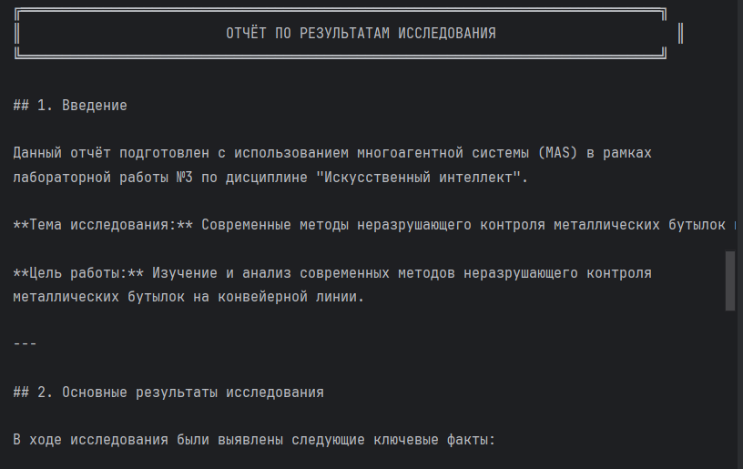

# Отчёт по лабораторной работе №3
## Дисциплина: Искусственный интеллект--
## Общая информация
| Параметр | Значение                |
|----------|-------------------------|
| **Студент** | [Мыльников Александр Русланович] |
| **Группа** | [ФИТ-221]               |
| **Дата выполнения** | [24.04.2026]            |
| **Специальность** | [02.03.02 Фундаментальная информатика и информационные технологии]         |
| **Тема диплома** | [Разработка системы неразрушающего контроля для выявления дефектов (брака) металлических бутылок на конвейерной линии] |--
## 1. Цель работы
[Изучить архитектурные паттерны многоагентных систем, реализовать Multi-Agent систему с координацией задач, создать специализированных агентов для предметной области неразрушающего контроля металлических бутылок, интегрировать систему с Yandex GPT для генерации содержательных ответов.]--
## 2. Выполненные задачи
- [x] Изучены архитектурные паттерны MAS
- [x] Реализовано 3 базовых агента (Researcher, Analyst, Writer)
- [x] Создан специализированный агент NDTInspectorAgent
- [x] Реализована координация через Crew
- [x] Настроена коммуникация между агентами (Message Bus)
- [x] Интегрирован Yandex GPT для генерации ответов
- [x] Написаны тесты (5/5 пройдены)
- [x] Код загружен в GitHub
## 3. Ход работы
### 3.1. Архитектура Multi-Agent системы
Для запуска рекомендуется использовать run_lab3.py
[Входная задача → ResearcherAgent → AnalystAgent → WriterAgent → Финальный отчёт
(исследование) (анализ) (генерация)
Коммуникация между компонентами осуществляется через асинхронную шину сообщений (Message Bus).]
### 3.2. Реализованные агенты
| Агент | Роль | Назначение |
|-------|----|-------|
| ResearcherAgent | Исследователь | Сбор информации |
| AnalystAgent | Аналитик | Анализ данных |
| WriterAgent | Писатель | Генерация отчётов |
| [NDTInspectorAgent] | [нспектор НК] | [Инспекция металлических бутылок] |
### 3.3. Специализированный агент
[**NDTInspectorAgent** - агент для неразрушающего контроля металлических бутылок, разработанный в соответствии с темой диплома.]
[Листинг кода]
[from src.ndt_inspector_agent import NDTInspectorAgent

inspector = NDTInspectorAgent()
result = inspector.execute_task(
    "Контроль качества бутылки",
    context={"bottle_id": "BOTTLE_001"}
)

print(f"Качество: {result['inspection_result']['quality_score']}%")
print(f"Решение: {result['quality_decision']['action']}")
Статистика: 2 годных, 3 бракованных, процент годных 40.0%, среднее качество 70.9%]
### 3.4. Координация между агентами
[Координация реализована в классе ResearchCrew с последовательным выполнением задач]
[ResearcherAgent → key_facts → AnalystAgent → insights → WriterAgent → document]
### 3.5. Тестирование
[Тестовый ответ: Неразрушающий контроль — это методы проверки материалов...
Специализированный агент (НК)
Инспекция 5 бутылок: 2 годных, 3 бракованных (40.0% годных)]
[]
### 3.6. Интеграция с дипломом
[Лабораторная работа №3 является прототипом и технологической основой для реализации интеллектуальной системы неразрушающего контроля в дипломном проекте. Разработанные компоненты могут быть масштабированы и адаптированы для работы с реальным оборудованием.
| Компонент из лабораторной работы | Применение в дипломе |
|----------------------------------|----------------------|
| NDTInspectorAgent | Интеллектуальный модуль анализа данных с датчиков |
| Multi-Agent координация (Crew) | Оркестрация нескольких методов контроля (вихретоковый, ультразвуковой, оптический) |
| Message Bus | Коммуникация между датчиками, контроллером и системой управления |
| Yandex GPT интеграция | Генерация отчётов, рекомендаций и аналитика брака |
| Базовые агенты (Researcher, Analyst, Writer) | Автоматическая документация и анализ статистики |]-

## 4. Результаты
| Критерий | Статус |
|----------|--------|
| Агенты работают | 
✅
 |
| Координация настроена | 
✅
 |
| Специализация выполнена | 
✅
 |
| Код в GitHub | 
✅
 |
--
## 5. Выводы
[Изучено в ходе работы:
Архитектурные паттерны многоагентных систем - последовательный конвейер (Pipeline Processing), координация через Crew, иерархическая структура.
Практическая реализация MAS - создание базовых агентов, наследование от BaseAgent, переопределение методов execute_task и get_capabilities.
Коммуникация между агентами - реализация асинхронной шины сообщений (Message Bus) с поддержкой подписки, публикации и приоритетов.
Интеграция с LLM - подключение к Yandex GPT через API, настройка аутентификации через IAM токен, генерация содержательных ответов.
Трудности:
Проблемы с импортами модулей
Неправильный парсинг ответа API
]--
## 6. Список источников
. . .
