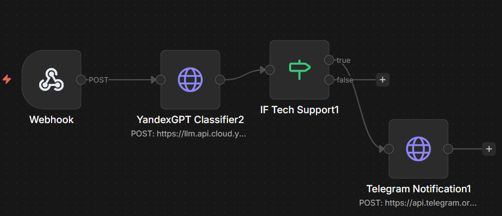
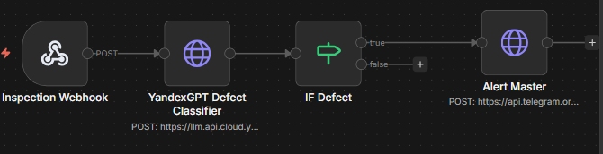
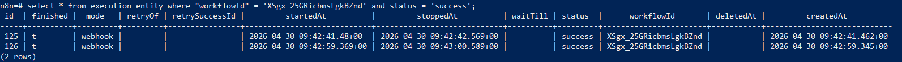
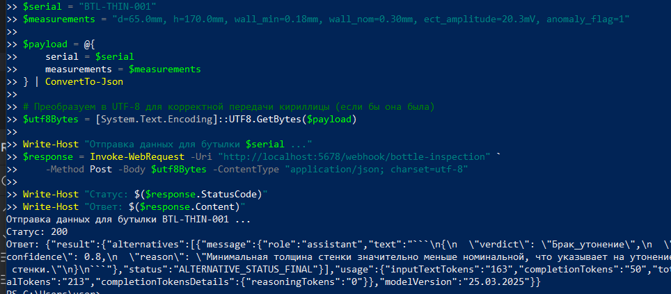

# Отчёт по лабораторной работе №4
## Дисциплина: Искусственный интеллект--
## Общая информация
| Параметр | Значение                |
|----------|-------------------------|
| **Студент** | [Мыльников Александр Русланович] |
| **Группа** | [ФИТ-221]               |
| **Дата выполнения** | [24.04.2026]            |
| **Специальность** | [02.03.02 Фундаментальная информатика и информационные технологии]         |
| **Тема диплома** | [Разработка системы неразрушающего контроля для выявления дефектов (брака) металлических бутылок на конвейерной линии] |--
## 1. Цель работы
[Изучить технологии автоматизации рабочих процессов с интеграцией AI-моделей. Развернуть платформу n8n, создать базовый и специализированный workflow, реализовать условную логику на основе AI-классификации и адаптировать решение под задачу дипломного проекта — неразрушающий контроль металлических бутылок.]--
## 2. Выполненные задачи
- [x] Развёрнута платформа автоматизации (n8n/ApiX-Drive)
- [x] Создан базовый workflow
- [x] Интегрирован российский LLM API
- [x] Реализовано ветвление логики
- [x] Создан специализированный workflow
- [x] Код загружен в GitHub--
## 3. Ход работы
### 3.1. Настройка платформы
[]
[С помощью `docker-compose.yml` развёрнуты контейнеры:
- `n8n_workflow` (порт 5678),
- `n8n_postgres` (PostgreSQL 15).
В `.env` заданы учётные данные Yandex Cloud, Telegram и параметры БД. Для обхода блокировки доступа к переменным в выражениях установлена `N8N_BLOCK_ENV_ACCESS_IN_NODE=false`; для исправления сетевых ошибок Telegram добавлен `NODE_OPTIONS=--dns-result-order=ipv4first` и публичные DNS-серверы.
Интерфейс n8n успешно открыт по `http://localhost:5678`]
### 3.2. Базовый workflow
[]
[Метод POST, URL `https://llm.api.cloud.yandex.net/foundationModels/v1/completion`.  
Тело запроса – статический JSON с подстановкой переменных
Заголовки: `Authorization: Bearer {{ ... }}`, `x-folder-id`, `Content-Type`.
**Тестирование:**  
Запрос через PowerShell (UTF-8) с сообщением «Не работает вход в систему, ошибка 403».  
В ответе от YandexGPT получена категория `техническая_поддержка`.  
Сработало условие IF, и в Telegram отправлено уведомление]
### 3.3. Интеграция с YandexGPT/GigaChat
| Параметр | Значение |
|----------|----------|
| Method | POST |
| URL | `https://llm.api.cloud.yandex.net/foundationModels/v1/completion` |
| Authentication | None |
| Headers | `Authorization: Bearer {{ $env.YANDEX_IAM_TOKEN }}`   `x-folder-id: {{ $env.YANDEX_FOLDER_ID }}`   `Content-Type: application/json` |
| Body (Specify Body → JSON) | статистический json |
[Классифицируй заявку как одну из категорий: техническая_поддержка, продажа, вопрос, жалоба. Ответь только названием категории.]
### 3.4. Специализированный workflow
[Webhook (POST /bottle-inspection) → HTTP Request (Defect Classifier) → IF (verdict ≠ "Годен") → Telegram Alert.]
[]
[{
  "modelUri": "gpt://{{ $env.YANDEX_FOLDER_ID }}/yandexgpt-lite/latest",
  "completionOptions": {
    "temperature": 0.2,
    "maxTokens": 150
  },
  "messages": [
    {
      "role": "system",
      "text": "Ты эксперт по неразрушающему контролю металлических бутылок. На основе предоставленных измерений (диаметр, высота, толщина стенок, амплитуда вихретокового сигнала, наличие аномалий) классифицируй изделие как: Годен, Брак_трещина, Брак_вмятина, Брак_утонение. Ответь в формате JSON: {\"verdict\": \"<категория>\", \"confidence\": <число от 0 до 1>, \"reason\": \"<краткое обоснование>\"}"
    },
    {
      "role": "user",
      "text": "{{ $json.body.measurements }}"
    }
  ]
}]

### 3.5. Тестирование
| Серийный номер | measurements | Ожидаемый вердикт | Уведомление |
|----------------|--------------|-------------------|-------------|
| BTL-OK-001     | d=65.0mm, h=170.0mm, wall_min=0.30mm, wall_nom=0.30mm, ect_amplitude=5.2mV, anomaly_flag=0 | Годен | Нет |
| BTL-THIN-001   | d=65.0mm, h=170.0mm, wall_min=0.18mm, wall_nom=0.30mm, ect_amplitude=20.3mV, anomaly_flag=1 | Брак_утонение | Да |
| BTL-CRACK-001  | d=65.1mm, h=169.9mm, wall_min=0.28mm, wall_nom=0.30mm, ect_amplitude=120.4mV, anomaly_flag=1 | Брак_трещина | Да |
| BTL-DENT-001   | d=64.2mm, h=168.5mm, wall_min=0.29mm, wall_nom=0.30mm, ect_amplitude=8.1mV, anomaly_flag=1 | Брак_вмятина | Да |
[]

### 3.6. Интеграция с дипломом
[Созданный workflow воспроизводит контур неразрушающего контроля:
-имитация поступления телеметрии с конвейера через HTTP;
-автоматическая классификация дефектов YandexGPT;
-оповещение при выявлении брака;
-протоколирование всех инспекций в PostgreSQL.]--
## 4. Результаты
| Критерий | Статус |
|----------|--------|
| Платформа развёрнута | 
✅
 |
| Workflow работает | 
✅
 |
| AI интегрирован | 
✅
 |
| Специализация выполнена | 
✅
 |
| Код в GitHub | 
✅
 |--
## 5. Выводы
[Изучены:
- установка и конфигурирование n8n с PostgreSQL,
- создание визуальных рабочих процессов с webhook, HTTP-запросами и условными переходами,
- интеграция AI-модели YandexGPT для классификации текстовых и измерительных данных,
Трудности:
- проблем с сетевыми ограничениями Docker ]--
## 6. Список источников
. . .