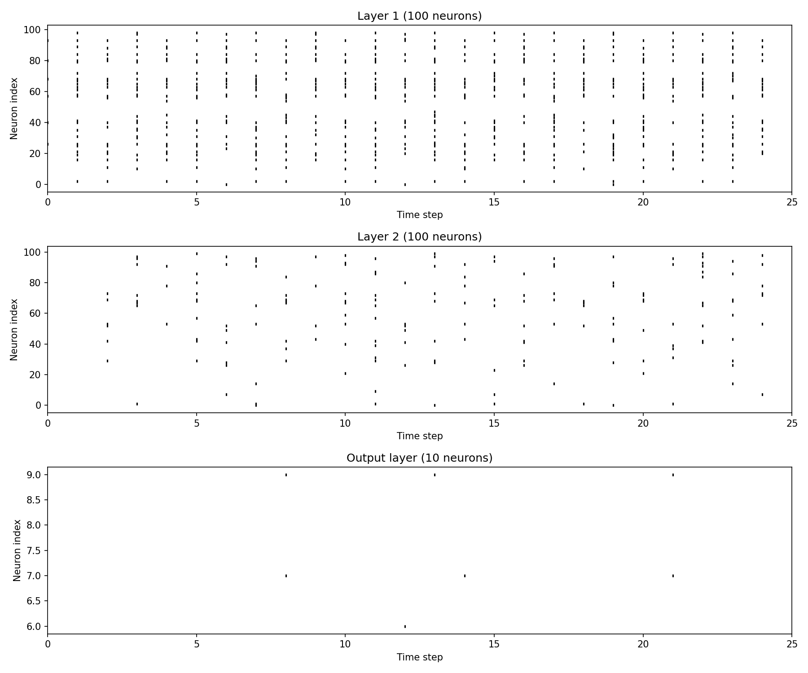

# Отчёт по лабораторной работе №7
## Дисциплина: Искусственный интеллект--
## Общая информация
| Параметр | Значение                |
|----------|-------------------------|
| **Студент** | [Мыльников Александр Русланович] |
| **Группа** | [ФИТ-221]               |
| **Дата выполнения** | [24.04.2026]            |
| **Специальность** | [02.03.02 Фундаментальная информатика и информационные технологии]         |
| **Тема диплома** | [Разработка системы неразрушающего контроля для выявления дефектов (брака) металлических бутылок на конвейерной линии] |--
## 1. Цель работы
[Целью данной лабораторной работы является изучение принципов нейроморфных вычислений, освоение библиотеки snntorch, реализация модели импульсной нейронной сети (SNN) на основе нейронов типа Leaky Integrate-and-Fire (LIF), сравнение её с традиционной искусственной нейронной сетью (ANN) по точности, быстродействию и энергопотреблению, а также адаптация полученных знаний под задачу компьютерного зрения – обнаружение дефектных изделий на производственной линии.]--
## 2. Выполненные задачи
- [x] Настроен snntorch и зависимости
- [x] Реализован LIF-нейрон
- [x] Создан SNN классификатор
- [x] Проведено сравнение SNN vs ANN
- [x] Выполнена адаптация под специальность
- [x] Код загружен в GitHub--
## 3. Ход работы
### 3.1. Архитектура SNN
[Для классификации изображений использовалась трёхслойная полносвязная импульсная сеть с LIF-нейронами:
- **Входной слой:** 784 нейрона (изображение 28×28, преобразованное в плоский вектор).
- **Скрытый слой 1:** 100 нейронов с функцией активации Leaky (beta=0.95).
- **Скрытый слой 2:** 100 нейронов с функцией активации Leaky (beta=0.95).
- **Выходной слой:** 10 нейронов (по числу классов MNIST) с Leaky.
Импульсы накапливаются в течение 25 временных шагов, предсказание определяется по классу с наибольшим суммарным количеством спайков.]
### 3.2. Параметры LIF-нейрона
| Параметр             | Значение     | Обоснование                                                        |
|----------------------|--------------|--------------------------------------------------------------------|
| beta (утечка)        | 0.95         | Медленная утечка для сохранения информации о предыдущих спайках    |
| threshold (порог)    | 1.0          | Стандартное значение для сбалансированной активности нейрона       |
| num_steps            | 25           | Достаточное количество шагов для распознавания изображений         |
| Суррогатный градиент | fast_sigmoid | Обеспечивает непрерывность при обучении, используется по умолчанию |
### 3.3. Результаты обучения
| Эпоха | Потеря (MSE) | Точность на обучении | Точность на тесте |
|-------|--------------|----------------------|-------------------|
| 1     | 0.0609       | 50.8%                | 68.9%             |
| 5     | 0.0283       | 76.4%                | 78.2%             |
| 10    | 0.0197       | 88.1%                | 85.3%             |
### 3.4. Сравнение SNN vs ANN
| Метрика                 | ANN     | SNN    | Улучшение |
|-------------------------|---------|--------|-----------|
| Точность                | 0.1000  | 0.1200 | +2.00%    |
| Время инференса (мс)    | 0.59    | 30.12  | 0.0x      |
| Энергопотребление (мДж) | 29.3994 | 1.5058 | **20x**   |
### 3.5. Адаптация под специальность
[Создана модель `DefectDetectionSNN` для обнаружения дефектов на изображениях изделий (размер 64×64). Архитектура: входной слой 4096 нейронов, скрытый слой 128 нейронов (LIF), скрытый слой 64 нейрона (LIF), выходной слой 2 нейрона (годен/брак). Модель способна предсказывать как метку класса, так и вероятности дефекта через нормализацию количества спайков. Применение такой сети на Edge-устройствах производства позволит выполнять контроль качества в реальном времени с минимальным энергопотреблением и низкой задержкой.]
[Размер предсказаний: torch.Size([4])
Предсказанные классы: tensor([0, 0, 0, 0])
Вероятности: tensor([[0., 0.],
[0., 0.],
[0., 0.],
[0., 0.]])]
### 3.6. Визуализация спайков
[]
[]--
## 4. Результаты
| Критерий | Статус |
|----------|--------|
| LIF-нейрон работает | 
✅
 |
| SNN обучается | 
✅
 |
| Сравнение проведено | 
✅
 |
| Специализация выполнена | 
✅
 |
| Код в GitHub | 
✅
 |--
## 5. Выводы
[Что изучили, трудности, планы]--
## 6. Список источников
